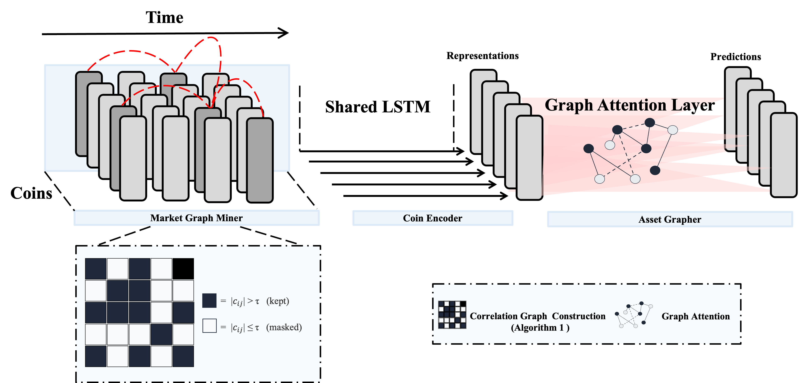
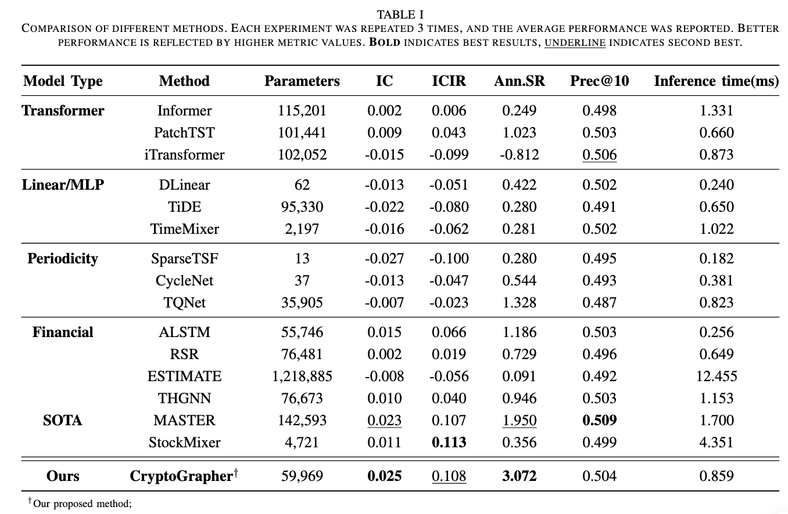

# CryptoGrapher

**CryptoGrapher: A Simple Yet Strong Graph-Based Architecture for Cryptocurrency Forecasting**.

We are the first to redefine pure-price cryptocurrency prediction as a graph learning problem, and we introduce a simple yet effective model, called CryptoGrapher, which utilizes graph attention layers to aggregate cross-asset information. 

## Architecture



## Overall Comparison




On real-world cryptocurrency data, CryptoGrapher achieves state-of-the-art forecasting accuracy and investment performance compared to prior approaches. We hope these findings open a new research direction for pure-price cryptocurrency prediction and inspire further graph-based exploration in this domain. 

# Getting Started

## Environment Requirements

```bash
pip install -r requirements.txt
```

## Dataset and Preprocessing

In order to improve file reading speed, we process the raw data to generate corresponding .pkl files. Datasets are provided in the dataset folder.

### CRYPTO_1D_ALL

```bash
# Process the data into CRYPTO_1D_ALL
cd dataset
python process_crypto_ALL.py
```

## Running the Code

### Train CryptoGrapher Model

```bash
cd src
python train.py
```

## Evaluation metrics

- **MSE:** Mean Squared Error
- **IC:** Information Coefficient
- **ICIR:** Information Coefficient Information Ratio
- **Prec@10:** Precision at Top 10
- **Ann.Sharpe:** Sharpe Ratio
